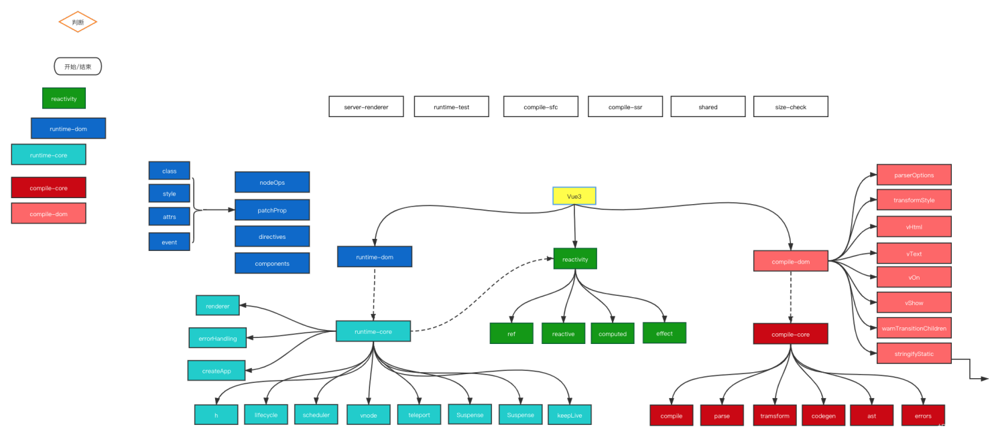

# 基础用法

## 前言

先来看一下vue3的构成：


vue3主要有3部分组成:runtime、compile、reactivity。

`runtime:`
生命周期层，解析setup、option、包括和vdom相关

`reactivity:`
只做响应式，处理数据。
将数据变为响应式的内容

`compile:`
做静态标记、block、ssr-render

## 为什么用vite
随着vue3到到来，尤大一并推出了vite（法语，读音[vi:t]），这是一款用来快速启动，更新项目的工具。它的基本工作原理是基于现在高版本浏览器内置的import语法拦截，省去了之前类似webpack需要打包运行的繁琐。

**vite的优势：**

* 快速的冷启动，不需要等待打包操作(项目秒启动，爽的飞起)
* 即时的热模块更新，替换性能和模块数量的解耦让更新飞起
* 真正的按需编译，不再等待整个应用编译完成，这是一个巨大的改变
* vite天然内置了typescript，无需再次引入loader
* 并且vite也成功地革了webpack的命，让webpack开发者直接喊大哥

**有图为证：**


## vite搭建项目
我们可以用vite脚手架快速的搭建vue3项目，运行命令

``` js
npm install create-vite-app -g
```

就可以在全局安装脚手架了。

然后用

``` js
create-vite-app my-first-vue3
```

来快速的搭建一个vue3项目。

## compositionAPI

vue3带来的composition API有很多语法上的改变，主要列举下面几个：
* reactive API
* ref API
* watch API变化
* computed API变化
* 生命周期钩子变化
* TypeScript和JSX支持


vue3中使用了composition API ，和vue 2.X的语法结构存在很大差异，不多说，先看一个代码片段:

``` vue
<template>
  <div>
    <h1>count is {{count}}</h1>
    <h1>double is {{double}}</h1>
    <button @click="add">click</button>
  </div>
</template>

<script>
  // 这种写法很好的支持了 tree-shaking
  import { ref, computed } from 'vue'
  export default {
    setup() { // setup 函数会在 beforeCreate 之后、created 之前执行
      let count = ref(0)
      function add() {
        count.value ++
      }
      const double = computed(()=>count.value*2)
      return {count, double, add}
    }
  }
</script>

```

### setup()

setup() 函数是 vue3 中，专门为组件提供的新属性。它为我们使用 vue3 的 Composition API 新特性提供了统一的入口。
setup现在支持返回一个渲染函数，这个函数返回一个JSX，JSX可以直接使用声明在setup作用域的响应式状态。

**调用时机**

setup 函数会在 beforeCreate 之后、created 之前执行

**接受参数：**
接收 props 数据
在 props 中定义当前组件允许外界传递过来的参数名称：

```js
props: {
    p1: String
}
```

通过 setup 函数的第一个形参，接收 props 数据：
```js
setup(props) {
    console.log(props.p1)
}
```
### 来看一下ref和reactive

Vue官方团队认为将state API 更名为reactive更为优雅，reactive等价于 Vue 2.x 的Vue.observable()。
value更名为ref，并提供isRef和toRefs。ref用创建一个包装对象，只具备一个响应式属性value，如果将对象指定为ref的值，该对象将被reactive方法深度遍历。


* 提供isRef，用于检查一个对象是否是ref对象：
const unwrapped = isRef(foo) ? foo.value : foo

* toRefs将reactive对象转换为普通对象，其中结果对象上的每个属性都是指向原始对象中相应属性的ref引用对象，这在组合函数返回响应式状态时非常有用，这样保证了开发者使用对象解构或拓展运算符不会丢失原有响应式对象的响应。

``` js
function useMousePosition() {
 const pos = reactive({
 x: 0,
 y: 0
 })
 // ...
 return toRefs(pos)
}
// x 和 y 现在具备了响应式
const { x, y } = useMousePosition()
```

ref 和reactive都是用来将数据进行动态响应，但是使用方法和用处略有不同。


### computed计算属性
直接上code，看看现在computed如何使用。

```js
import { watch, watchEffect, computed } from 'vue'
// 1、创建只读的计算属性
const computedCount = computed(() => count.value + 1)
// 2、创建可读可写的计算属性
const computedCount2 = computed({
   get: () => writeCount.value + 2,
   set: (val) => {
      return writeCount.value =  val + 2
  }
})
// 可以直接修改computed的值，在Vue2.x中无法修改
// computedCount2 = 123 

```
### watch、watchEffect


